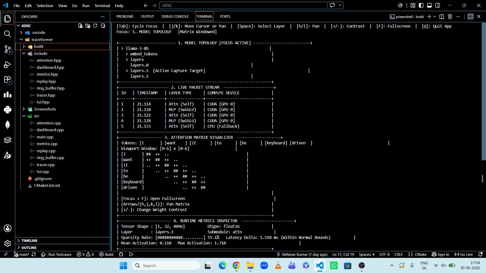
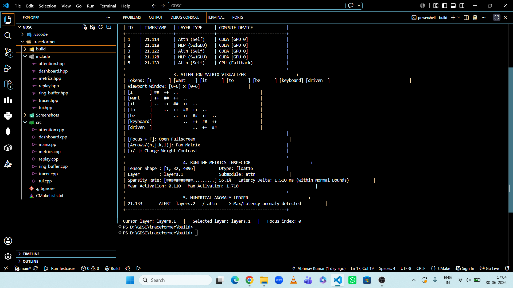
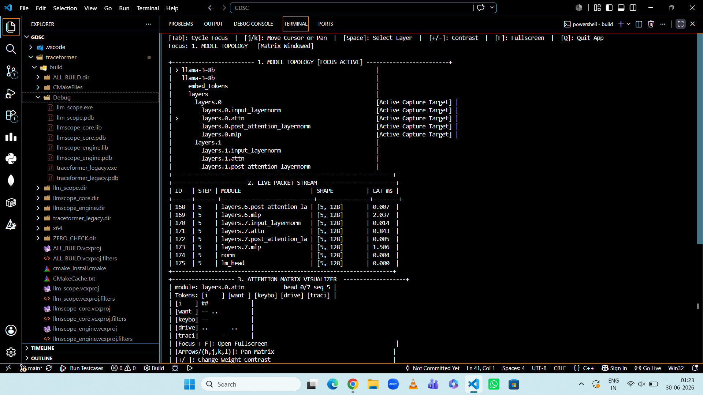
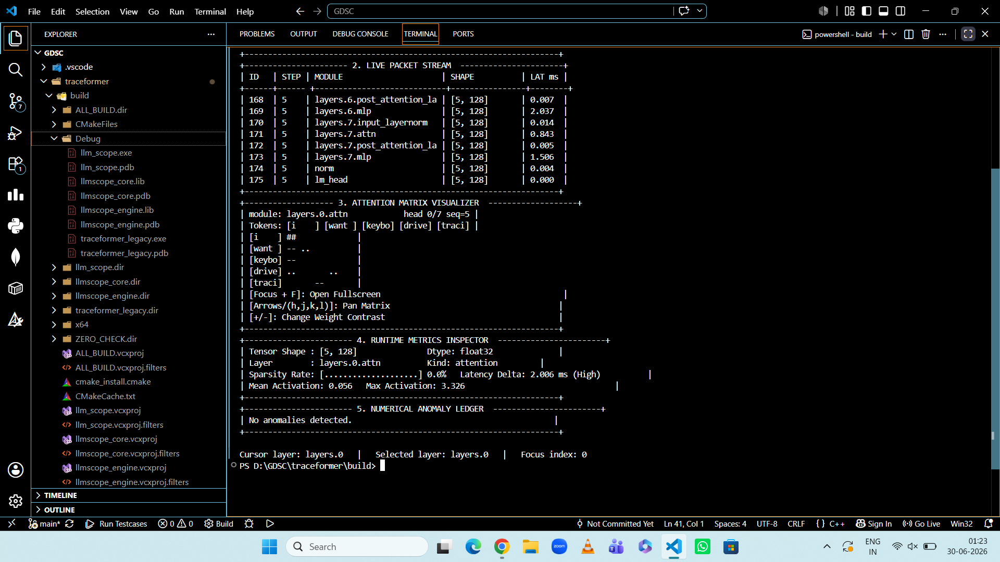

# Local LLM Tracing and Replay Platform

A lightweight C++ project that simulates how a local transformer/LLM can be traced, inspected, and visualized through a terminal dashboard.

This repository focuses on:

* layer-wise telemetry capture
* fixed-size ring-buffer logging
* attention visualization
* runtime metrics inspection
* anomaly tracking
* replay of stored trace sessions
* keyboard-driven terminal dashboard

---

## Traceformer Dashboard Preview





---

## Project Overview

This project was built as a tracing and diagnostics platform for understanding how data flows through a transformer-style model.

The system is designed to:

* hook into a model execution pipeline in a non-invasive way
* capture layer-level metadata such as tensor shape, latency, sparsity, mean, and max activation
* visualize traces live in a terminal-based dashboard
* replay previously saved sessions
* highlight possible numerical anomalies

---

## Final Implementation Choice

During development, I explored two dashboard/tracing approaches:

1. **A modular `llmscope` architecture**
   This version split the project into separate `core`, `engine`, and `tui` layers.

2. **The legacy dashboard-based implementation**
   This version was cleaner, more stable, and easier to demonstrate live.

For the final submission, I chose the **legacy dashboard-based version** because it produced a smoother demo, fewer build issues, and a clearer visualization flow.

The modular `llmscope` approach was useful as an experiment, but it was not retained in the final demo branch to avoid confusion and keep the repository focused on one stable implementation.

---

## Features

### Core Tracing

* fixed-size ring buffer for trace events
* tracer for layer/submodule events
* metadata capture for:

  * event id
  * token id
  * layer name
  * submodule name
  * tensor shape
  * dtype
  * timestamp
  * latency
  * sparsity
  * mean activation
  * max activation
  * anomaly flag

### Interactive Dashboard

* model topology panel
* live packet stream panel
* attention matrix visualizer
* runtime metrics inspector
* anomaly ledger
* keyboard navigation
* focus switching with `Tab`
* layer selection with `j/k`
* matrix navigation with `h/j/k/l`
* contrast adjustment with `+/-`
* fullscreen toggle with `F`
* quit with `Q`

### Replay Engine

* save trace sessions
* load old trace logs
* replay past sessions inside the dashboard

---

## Dashboard Overview

### 1. Model Topology

Shows the layer structure and lets you select the active capture target.

### 2. Live Packet Stream

Displays recent trace events in a compact stream.

### 3. Attention Matrix Visualizer

Shows a token-by-token attention-style view for the selected layer.

### 4. Runtime Metrics Inspector

Displays:

* tensor shape
* dtype
* sparsity rate
* latency
* mean activation
* max activation

### 5. Numerical Anomaly Ledger

Lists suspicious events such as:

* high max activation
* unusually high latency
* high sparsity
* NaN/Inf-like behavior

---

## Experimental Dashboard: LLMScope Variant

During development, I also built an alternative modular architecture called **LLMScope**, focused on deeper modular separation (`core`, `engine`, `tui`).

This version explored:

* modular tracing engine
* separated core architecture
* alternative dashboard rendering

Although technically interesting, it introduced additional build complexity and did not provide better visualization quality than the final Traceformer dashboard.

Therefore, this approach was rejected in favor of the final implementation.

### LLMScope Screenshots





---

## Build Instructions

### Requirements

* C++17 compiler
* CMake 3.14 or later

### Configure and build

From the project root:

```bash
mkdir build
cd build
cmake ..
cmake --build . --config Debug
```

If your system uses a specific CMake path on Windows:

```bash
cd build
& "C:\Program Files\CMake\bin\cmake.exe" ..
& "C:\Program Files\CMake\bin\cmake.exe" --build . --config Debug
```

---

## Run Instructions

From the build directory:

```bash
.\Debug\traceformer.exe
```

If the executable is created directly in the build folder on your system:

```bash
.\traceformer.exe
```

---

## Replay a Saved Session

```bash
.\Debug\traceformer.exe --record session.trace
.\Debug\traceformer.exe --replay session.trace
```

---

## Controls

* `Tab` → switch focus between dashboard panels
* `j/k` → move through layers
* `h/j/k/l` → pan in the attention matrix
* `+/-` → adjust attention contrast
* `Space` → select current layer
* `F` → toggle fullscreen-style matrix view
* `Q` → quit

---

## Project Structure

```text
traceformer/
├── include/
│   ├── attention.hpp
│   ├── dashboard.hpp
│   ├── metrics.hpp
│   ├── replay.hpp
│   ├── ring_buffer.hpp
│   ├── tracer.hpp
│   └── tui.hpp
├── src/
│   ├── attention.cpp
│   ├── dashboard.cpp
│   ├── main.cpp
│   ├── metrics.cpp
│   ├── replay.cpp
│   ├── ring_buffer.cpp
│   ├── tracer.cpp
│   └── tui.cpp
├── Screenshots/
│   ├── dashboard1/
│   └── dashboard2/
├── CMakeLists.txt
```

---

## Author

**Abhinav Kumar**
